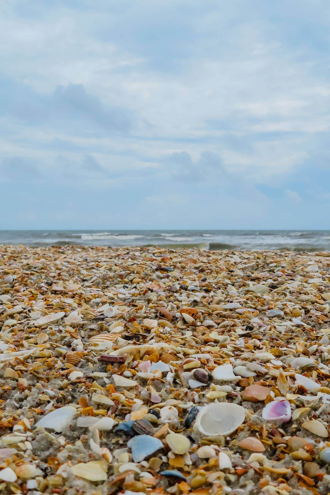

# Beach

Beach is a CLI tool that lets you easily connect to and store
a collection of many shells (SSH sessions).

Just as each seashell is unique, each SSH session is uniquely stored
so that you can quickly access it again without re-entering your credentials.